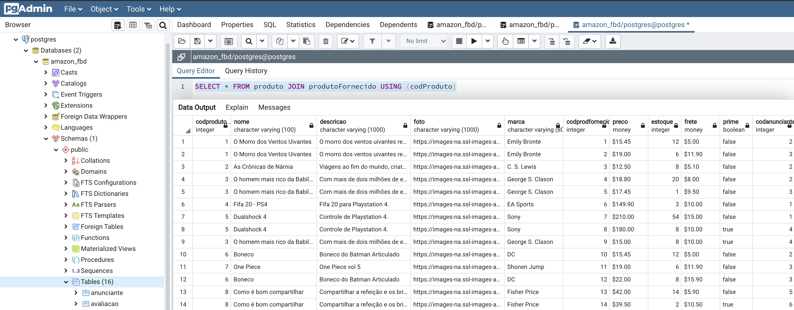
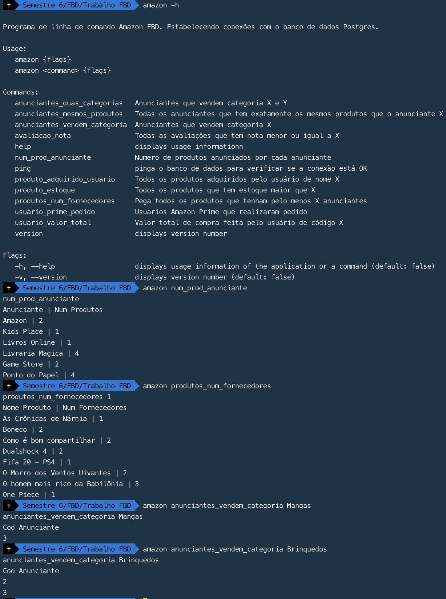

# Amazon CLI Postgres

Golang CLI connecting to Postgres DB and running SQL queries.

SQL folder contains all necessary data.

## Images

PgAdmin showing product data

Command-line interface

## Technology

- Golang
- Postgres
- Commando CLI
- DotEnv
